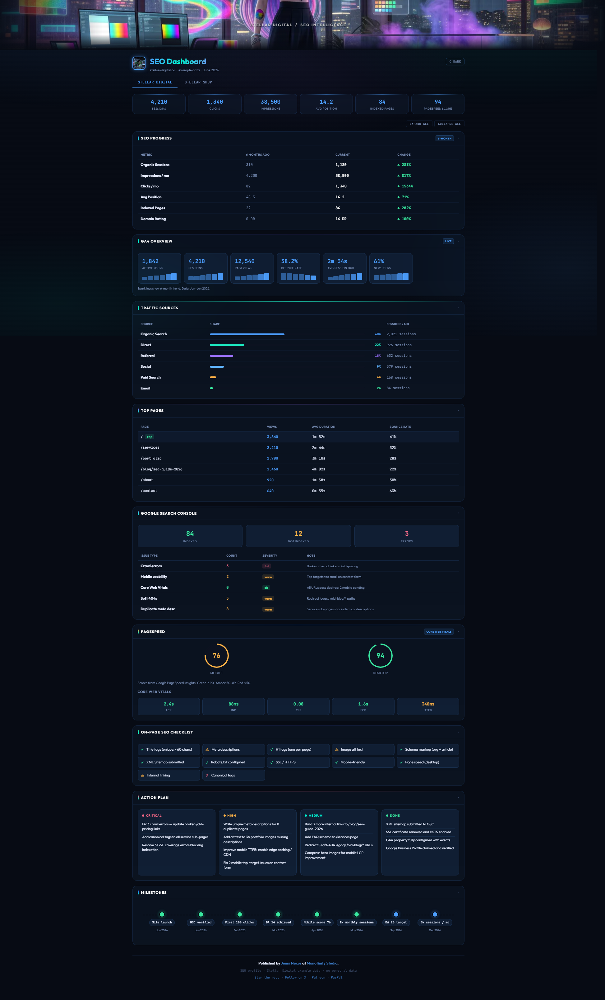
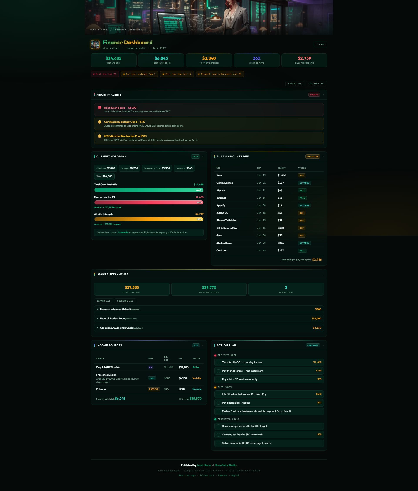
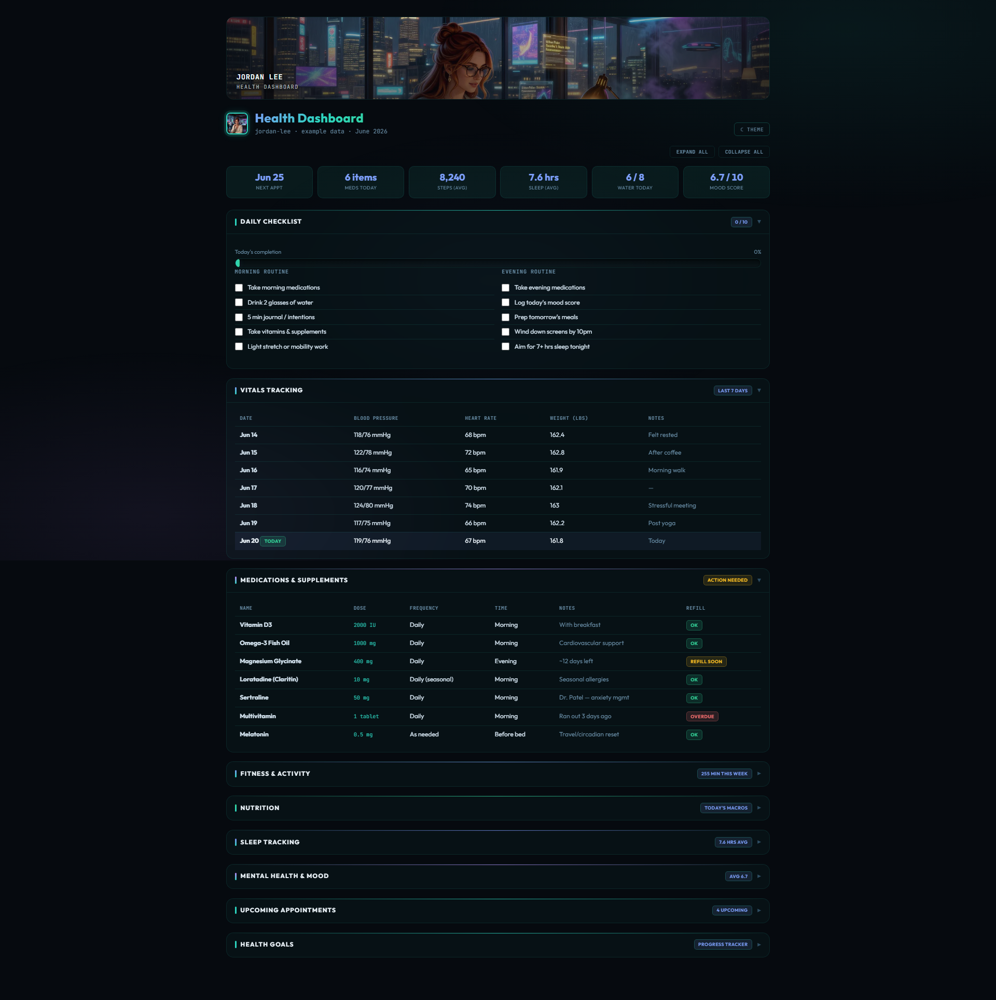

<div align="center">

# Dashboard


**Make one dashboard. For everyone.** ✨

`dashboard` is a profile-based, local-first seed kit. Pick a profile (`SEO`, `finances`, `health`, `pets`),
drop in JSON, get a polished single-file dashboard in seconds — no server, no build, no backend.

</div>

---

## See it first

| SEO | Finances | Health | Pets |
|---|---|---|---|
|  |  |  | Open `pets.html` |
| `profiles/seo/seo.html` | `profiles/finances/finances.html` | `profiles/health/health.html` | `profiles/pets/pets.html` |
| Aurora · midnight blue | Emerald · gold | Vitality · teal · lavender | Dusk · amber · teal |

Open any of these directly in your browser. They're self-contained — only Chart.js + Google Fonts load from the network.

---

## Quick Start

**Don't want to use a terminal?** Download this repo as a ZIP from GitHub, unzip it, and double-click
`profiles/seo/seo.html` (or any profile HTML) in your file explorer. That's your dashboard.

**Prefer the terminal?**

```bash
git clone https://github.com/jenninexus/dashboard.git
cd dashboard
```

Then pick one:

```bash
# Option A — open a profile directly in your browser
start profiles/seo/seo.html           # Windows
open profiles/seo/seo.html             # macOS
xdg-open profiles/seo/seo.html        # Linux
```

```bash
# Option B — scaffold your own copy into ./my-dashboard/
npm run build-dashboard -- --profile seo --name "Your Name"
```

Then edit `my-dashboard/data.json` (every field has a `_comment` explaining what to put there) and open `my-dashboard/dashboard.html`.

**Prefer an IDE?** Open this repo in VS Code, Cursor, opencode, or your favorite editor. Open `dashboard.code-workspace.example` as a workspace (or copy it to `dashboard.code-workspace` for a themed Plasma Green window — the local copy is gitignored so your tweaks stay private).

---

## Profiles

Each profile is a self-contained dashboard for one domain. Open the example HTML directly, or scaffold your own copy.

| Profile | Tracks | Per-profile theme |
|---|---|---|
| **SEO** — `profiles/seo/seo.html` | GA4 · Search Console · PageSpeed · Cloudflare | Aurora SEO (midnight blue / aurora) |
| **Finances** — `profiles/finances/finances.html` | Cash vs obligations · bills · loans · income | Emerald Finance (emerald / gold) |
| **Health** — `profiles/health/health.html` | Vitals · meds · labs · habits · sleep | Vitality Health (teal / lavender) |
| **Pets** — `profiles/pets/pets.html` | Weight · QoL · fluids · red flags | Dusk Companion (amber / teal) |

Replace the example numbers in `data.json` with your own. The example data is fictional on purpose — easy to swap without leaking anything real.

**Sister repos** (same family, different job):

- [jenninexus/fin](https://github.com/jenninexus/fin) — operational finance *workspace* (autopay, archive, startup script). This kit’s finances profile is the snapshot demo.
- [jenninexus/senior-pet-care](https://github.com/jenninexus/senior-pet-care) — printable Markdown pet-care tracker. This kit’s pets profile is the optional visual layer.

---

## Themes

Palettes live in `themes/` and can be copied into a profile's `<style>` block or `<link>`-ed when served over HTTP.

The palette direction is inspired by the workspace themes in [jenninexus/syn-themes](https://github.com/jenninexus/syn-themes).

Bundled palettes:

- `plasma-green.css` — default dark neon palette
- `aurora-borealis.css` — prismatic turquoise, purple, and pink (+ `aurora-borealis.effects.css` for shimmer)
- `midnight-blue.css` — cooler blue starter
- `aurora-seo.css` — used by the SEO profile
- `emerald-finance.css` — used by the Finances profile
- `vitality-health.css` — used by the Health profile
- `dusk-companion.css` — used by the Pets profile

`plasma-green` is dashboard neon green (`#00e879`). It is **not** Synagraphic Plasma Drift (pink `#e050a0`).

---

## Why this kit?

- **Zero install** — open a profile HTML from `file://`. Chart.js + Google Fonts load from CDN. That's it.
- **Zero deps** — `package.json` declares nothing. The scaffolder uses only Node's built-ins.
- **Zero backend** — every profile is hand-fed JSON today. No API keys, no servers, no telemetry.
- **Profiles drive what you track.** Themes drive how it looks. AI agents can scaffold + customize either.

---

## Make it your own

- **Add a metric** → add the field to `example-data.json` (with a `_comment`) + reference it in the profile HTML.
- **Add a chart** → drop a `<canvas id="x">` in a `.chart-container`, init `new Chart(...)` in the script block.
- **Add a section** → copy a card block, give it an id, wire its data.
- **New domain entirely** → copy `profiles/<closest>` → `profiles/<yours>`, edit the manifest + schema.

Point an AI coding agent at this repo (Claude Code, Cursor, opencode, Copilot) and ask it to extend a profile — see [docs/architecture.md](docs/architecture.md) for the deeper how-it-works.

---

## Docs

- **[Getting started](docs/getting-started.md)** — pick a profile, edit data, deploy
- **[Profile system](docs/profile-system.md)** — how profiles work + how to build your own
- **[Architecture](docs/architecture.md)** — tech stack, deps, env vars, screenshots
- **[Finances profile](docs/finances-profile.md)** — playbook for the personal finance variant

---

## Contributing

Prefer focused PRs: one new profile at a time, include a clear `example-data.json`, keep output static and local-first, add or update docs for any new behavior.

MIT — use, fork, customize.

---

<div align="center">

If this dashboard seed helps you build something useful: ✨

[Star this repo](https://github.com/jenninexus/dashboard) · [jenninexus.com/links](https://jenninexus.com/links) · [Patreon](https://www.patreon.com/c/JenniNexus) · [PayPal](https://paypal.me/jenninexus)

Made with 💚 by [Jenni](https://github.com/jenninexus) at [Monofinity Studio](https://github.com/monofinitystudio)

</div>
