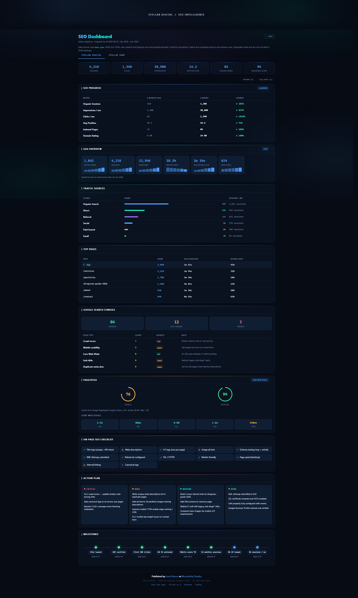
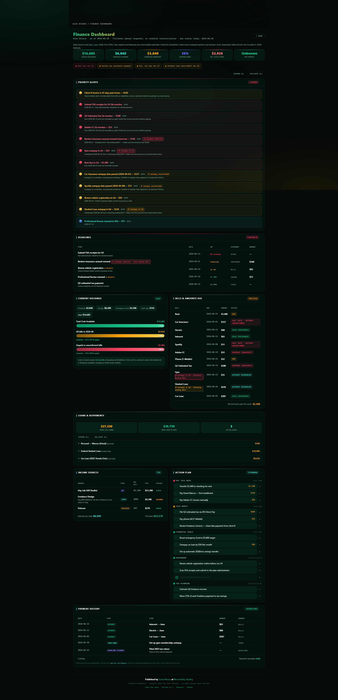
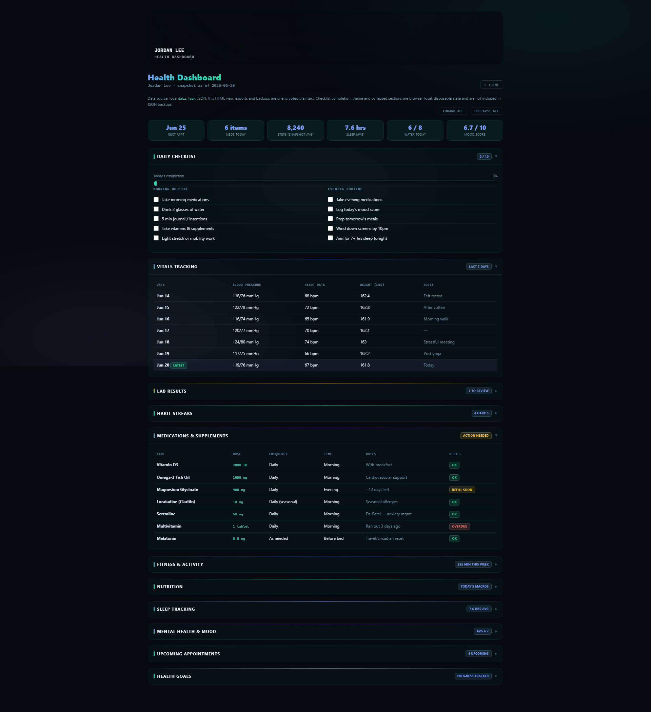
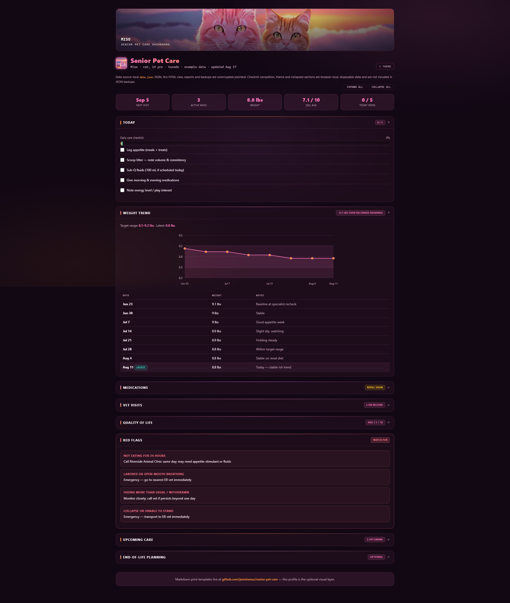

<div align="center">

# Dashboard


**Make one dashboard. For everyone.** ✨

Choose SEO, finances, health, or pets; edit local JSON; get a polished standalone dashboard. No
account, backend, telemetry, API key, package install, or network connection is required.

</div>

---

## See it first

| SEO | Finances | Health | Pets |
|---|---|---|---|
|  |  |  |  |
| Aurora SEO | Emerald Finance | Vitality Health | Dusk Companion |

The example HTML files under `profiles/` open directly from `file://` and use fictional data. They
have no required CDN, remote font, or remote chart runtime.

## Quick start

Download or clone the repository, then choose a workflow.

### Local wizard

On Windows, double-click `Dashboard.cmd`. On macOS or Linux, use:

```bash
npm run dashboard
```

The temporary wizard runs only on `127.0.0.1`, edits the output folder you choose, and shuts down
when you press **Stop** or it becomes idle. Its forms and raw-JSON editor use the same validation and
update core as the command line.

### Command line

```bash
git clone https://github.com/jenninexus/dashboard.git
cd dashboard
npm run build-dashboard -- --profile seo --name "Your Name"
```

Then edit `my-dashboard/data.json`, rebuild only the embedded data region, and open the result:

```bash
npm run dashboard:update -- --out my-dashboard
```

The updater validates the profile contract, preserves custom HTML/CSS outside the generated data
block, and keeps one rotating `dashboard.html.bak`. It never treats `--force` as an update path and
never rewrites `data.json`.

## Profiles

| Profile | Tracks | Default theme |
|---|---|---|
| **SEO** | GA4 · Search Console · PageSpeed · Cloudflare | `aurora-seo` |
| **Finances** | cash · bills · loans · income snapshot | `emerald-finance` |
| **Health** | vitals · meds · labs · habits · sleep | `vitality-health` |
| **Pets** | weight · quality of life · fluids · red flags | `dusk-companion` |

Each profile owns four public files: its renderer, fictional example, routing manifest, and compact
versioned editor contract. See [profiles/README.md](profiles/README.md) for the exact format.

The finances profile is a customizable snapshot, not a payment ledger. See
[docs/finances-profile.md](docs/finances-profile.md) for its scope. For printable pet-care sheets,
use [jenninexus/senior-pet-care](https://github.com/jenninexus/senior-pet-care).

## Themes

`themes/manifest.json` is the public theme catalog. It lists default/compatible profiles and the CSS
files shipped by each theme. Profile defaults remain intentionally distinct; alternates include
Plasma Green, Aurora Borealis, and Midnight Blue.

The committed CSS is the complete public runtime contract. A generated dashboard never imports a
private kit or machine-local path.

## Privacy and safety

- `data.json`, generated HTML, exports, and `dashboard.html.bak` are unencrypted plaintext files.
- Generated dashboards, local plans, secrets, agent state, and QA captures are gitignored.
- Profile examples are fictional. Do not use real financial, health, analytics, or pet records as
  fixtures, screenshots, issues, or documentation.
- Browser-local theme, collapse, and checklist state is disposable and is not included in JSON
  backups.

The exact public/local boundary is documented in
[docs/PUBLIC-LOCAL-SPLIT.md](docs/PUBLIC-LOCAL-SPLIT.md).

## Repository map

| Path | Purpose |
|---|---|
| `profiles/` | Four domain renderers, examples, manifests, and editor contracts |
| `themes/` | Public theme CSS and compatibility manifest |
| `scripts/` | Shared core, CLI, local wizard, boundary check, and optional capture wrapper |
| `docs/images/` | Runtime art referenced by profiles and copied into generated output |
| `docs/screenshots/hero/` | Curated four-image README gallery only |
| `configs/` | Portable optional screenshot-capture configuration |

Full breakpoint captures are local QA evidence, not public documentation assets.

## Verify or contribute

```bash
npm test
npm run profiles
npm run check:public-boundary
```

Keep changes static, offline-capable, fictional, and profile-specific. A new profile must include all
four profile files, safe text rendering, contract tests, and documentation for any new behavior.

More detail: [getting started](docs/getting-started.md) ·
[profile system](docs/profile-system.md) · [architecture](docs/architecture.md) ·
[finances profile](docs/finances-profile.md)

MIT — use, fork, customize.

---

<div align="center">

[Star this repo](https://github.com/jenninexus/dashboard) · [jenninexus.com/links](https://jenninexus.com/links)

Made with 💚 by [Jenni](https://github.com/jenninexus) at [Monofinity Studio](https://github.com/monofinitystudio)

</div>
